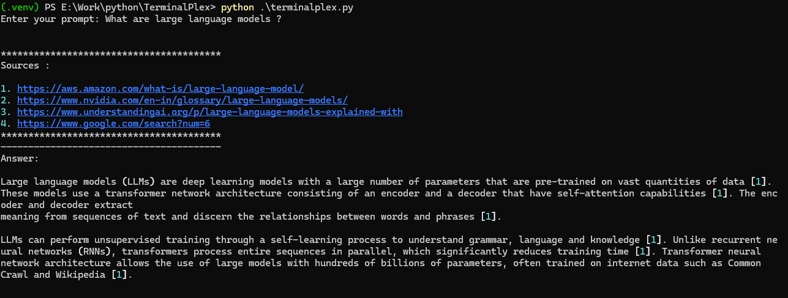

# TerminalPlex
A tiny perplexity clone running inside terminal using any LLM model.



## How To Run
- Clone this repository
- Create a .env file inside the file directory and add values.
    ```
    # .env file
    API_KEY=
    BASE_URL=
    MODEL_NAME=
    MAX_TOKENS=
    ```
- Execute ``` pip install -r requirements.txt ``` to install all the packages.
- Run using ``` python ./terminalplex.py ```.
